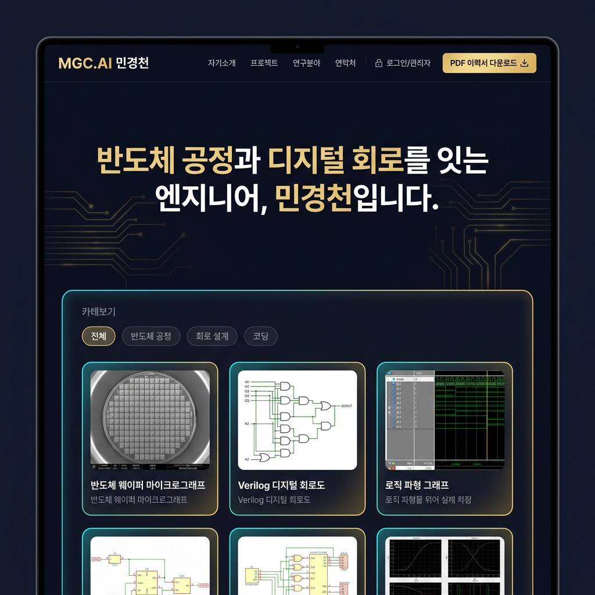

# 🎨 UI/UX 디자인 시스템 가이드 (design.md)
## 민경천 반도체 공정 & 디지털 회로 엔지니어 포트폴리오

---

## 1. 디자인 컨셉 및 정체성 (Design Identity)

* **디자인 컨셉**: **Silicon & Circuit Architecture (실리콘 반도체 웨이퍼와 회로 트레이스의 정교함)**
* **핵심 분위기**: 딥 미드나잇 인디고(#0B0E1B)를 바탕으로, 실리콘 웨이퍼의 샴페인 골드(#FFD700)와 디지털 신호 흐름을 상징하는 전기적 시안(#00F2FE) 포인트가 어우러진 은은하고 세련된 글래스모피즘 테크니컬 디자인.
* **UI/UX 3대 원칙**:
  1. **가독성 최우선 (High Readability)**: 채용 담당자가 3초 만에 핵심 역량을 파악하도록 명암비 7:1 이상의 고대비 텍스트 유지.
  2. **정교한 대칭미 (Engineering Precision)**: 실리콘 블록과 그리드 레이아웃을 반영한 픽셀 단위의 정돈된 컴포넌트배치.
  3. **직관적 촉각 반응 (Tactile Feedback)**: 버튼 호버 및 모달 전환 시 부드럽고 고급스러운 마이크로 인터랙션 제공.

---

## 2. 컬러 팔레트 & 디자인 토큰 (Color Palette)

### 2.1 메인 배경 & 서페이스 컬러
* **Primary Background (`--bg-midnight`)**: `#0B0E1B` (우주 및 깨끗한 클린룸을 연상시키는 딥 인디고)
* **Secondary Surface (`--bg-surface`)**: `rgba(20, 26, 48, 0.65)` (글래스모피즘 카드리 박스, `backdrop-filter: blur(16px)`)
* **Elevated Surface (`--bg-elevated`)**: `rgba(30, 41, 75, 0.85)` (모달 팝업 및 드롭다운 메뉴)

### 2.2 브랜드 엑센트 컬러
* **Primary Accent - Wafer Gold (`--color-gold`)**: `#FFD700` (반도체 와이어/웨이퍼의 황금빛 포인트)
  * Hover State: `#FFE566`
  * Soft Glow: `rgba(255, 215, 0, 0.35)`
* **Secondary Accent - Signal Cyan (`--color-cyan`)**: `#00F2FE` (디지털 회로 신호 및 코딩 포인트)
  * Hover State: `#33F5FF`
  * Soft Glow: `rgba(0, 242, 254, 0.35)`

### 2.3 텍스트 & 테두리 토큰
* **Text Primary (`--text-primary`)**: `#F8FAFC` (헤드라인, 주요 타이틀)
* **Text Secondary (`--text-secondary`)**: `#94A3B8` (본문 설명, 서브 타이틀)
* **Text Muted (`--text-muted`)**: `#64748B` (캡션, 날짜, 태그)
* **Border Glass (`--border-glass`)**: `rgba(255, 255, 255, 0.08)`
* **Border Circuit (`--border-circuit`)**: `rgba(0, 242, 254, 0.25)`

---

## 3. 타이포그래피 체계 (Typography)

### 3.1 폰트 패밀리
* **영문 UI 및 헤딩**: `'Plus Jakarta Sans', sans-serif` (모던하고 스포티한 엔지니어링 느낌)
* **한글 본문 및 설명**: `'Noto Sans KR', sans-serif` (깔끔하고 또렷한 가독성)
* **수치, 회로 파라미터 & 코드**: `'JetBrains Mono', monospace` (개발자/엔지니어 전용 모노스페이스)

### 3.2 타이포그래피 스케일

| 요소 | 폰트 사이즈 | 굵기 (Weight) | 행간 (Line-height) | 용도 |
| :--- | :--- | :--- | :--- | :--- |
| **Hero Title (h1)** | `2.75rem` (44px) | 800 (ExtraBold) | 1.2 | 메인 타이틀, 히어로 섹션 |
| **Section Title (h2)** | `1.85rem` (29.6px) | 700 (Bold) | 1.3 | 각 섹션 제목 (소개, 작업물) |
| **Card Title (h3)** | `1.25rem` (20px) | 600 (SemiBold) | 1.4 | 프로젝트 제목, 역량 카드 |
| **Body Regular** | `1.0rem` (16px) | 400 (Regular) | 1.6 | 일반 본문 텍스트 |
| **Body Small / Tag** | `0.85rem` (13.6px) | 500 (Medium) | 1.5 | 기술 스택 태그, 날짜 |
| **Code / Stat Value**| `0.95rem` (15.2px) | 600 (SemiBold) | 1.4 | 수치 데이터, 소스 코드 |

---

## 4. 컴포넌트 디자인 가이드 (Component Specs)

### 4.1 버튼 가이드 (Button System)

#### A. 버튼 크기 체계 (Button Scale)
* **Large (`.btn-lg`)**:
  * 높이: `48px` | 패딩: `0.85rem 1.8rem` | 폰트 크기: `1.0rem` | 둥글기: `12px`
  * 용도: 히어로 CTA (작업물 보기), 이력서 PDF 다운로드
* **Medium (`.btn-md`)**:
  * 높이: `40px` | 패딩: `0.65rem 1.25rem` | 폰트 크기: `0.9rem` | 둥글기: `10px`
  * 용도: 카테고리 필터 탭, 모달 내 닫기/링크 버튼
* **Small (`.btn-sm`)**:
  * 높이: `32px` | 패딩: `0.4rem 0.85rem` | 폰트 크기: `0.8rem` | 둥글기: `8px`
  * 용도: 자기소개 수정/저장 버튼, 태그 추가/삭제
* **Icon Only (`.btn-icon`)**:
  * 규격: `42px x 42px` 원형/라운드 | 용도: 관리자 인증 열쇠 버튼, 사운드/테마 토글

#### B. 버튼 스타일 변형 (Button Variants)
1. **Primary Gold Button (`.btn-primary`)**:
   * 배경: `linear-gradient(135deg, #FFD700, #FFA500)`
   * 텍스트: `#0B0E1B` (Bold)
   * 호버 효과: `transform: translateY(-2px)`, 그림자 `0 6px 20px rgba(255, 215, 0, 0.4)`
2. **Secondary Outline Button (`.btn-outline`)**:
   * 배경: `transparent` | 테두리: `1px solid rgba(0, 242, 254, 0.4)`
   * 텍스트: `#00F2FE`
   * 호버 효과: `background: rgba(0, 242, 254, 0.1)`, 테두리 및 글로우 강조
3. **Glass Filter Pill (`.cat-pill`)**:
   * 배경: `rgba(255, 255, 255, 0.04)` | 테두리: `1px solid rgba(255, 255, 255, 0.1)`
   * 활성화 상태 (`.active`): 황금빛 테두리 + `rgba(255, 215, 0, 0.15)` 배경 칩

---

### 4.2 프로젝트 카드 컴포넌트 (Project Card)
* **카드 래퍼**: `background: rgba(20, 26, 48, 0.65)`, `border: 1px solid rgba(255, 255, 255, 0.08)`, `border-radius: 16px`
* **이미지 영역**: `16:9` 비율 썸네일 (회로도/실험 데이터), `object-fit: cover`
* **호버 인터랙션**: 카드가 위로 `4px` 떠오르며 시안 글로우 테두리가 강조됨 (`box-shadow: 0 12px 30px rgba(0, 242, 254, 0.15)`).

---

### 4.3 나만 편집 가능한 자기소개 영역 (Inline Editor UI)
* **일반 모드**: 깔끔한 텍스트로 표시
* **편집 모드 활성화 시 (`.is-editing`)**:
  * 수정 가능한 영역 테두리에 점선 황금빛 가이드라인 (`border: 1px dashed #FFD700`) 활성화
  * 우상단에 [💾 변경사항 저장] 및 [❌ 취소] 조작 툴바 플로팅

---

## 5. 그리드 & 레이아웃 규격 (Layout & Grid)

* **최대 폭 (Container Max Width)**: `1200px` (중앙 정렬, 좌우 최소 패딩 `1.5rem`)
* **섹션 간격 (Section Spacing)**: `80px` (Desktop), `50px` (Mobile)
* **그리드 구조**:
  * **역량 매트릭스 Grid**: `repeat(auto-fit, minmax(280px, 1fr))`
  * **작업물 카드 Grid**: `repeat(auto-fit, minmax(320px, 1fr))`

---

## 6. CSS 모듈 매핑 구조 (File Mapping)

개발 구현 시 CSS 파일은 아래 4가지 모듈로 분리 작성합니다:

1. **`css/variables.css`**: 색상 토큰, 타이포그래피 규격, 그림자, 글래스모피즘 수치
2. **`css/global.css`**: 리셋, body 배경, 메인 컨테이너 그리드, 푸터
3. **`css/components.css`**: 버튼, 프로젝트 카드, 자기소개 편집 필드, 모달 팝업, 태그 칩
4. **`css/animation.css`**: 호버 애니메이션, 회로 신호 파형 키프레임, 모바일 미디어 쿼리
